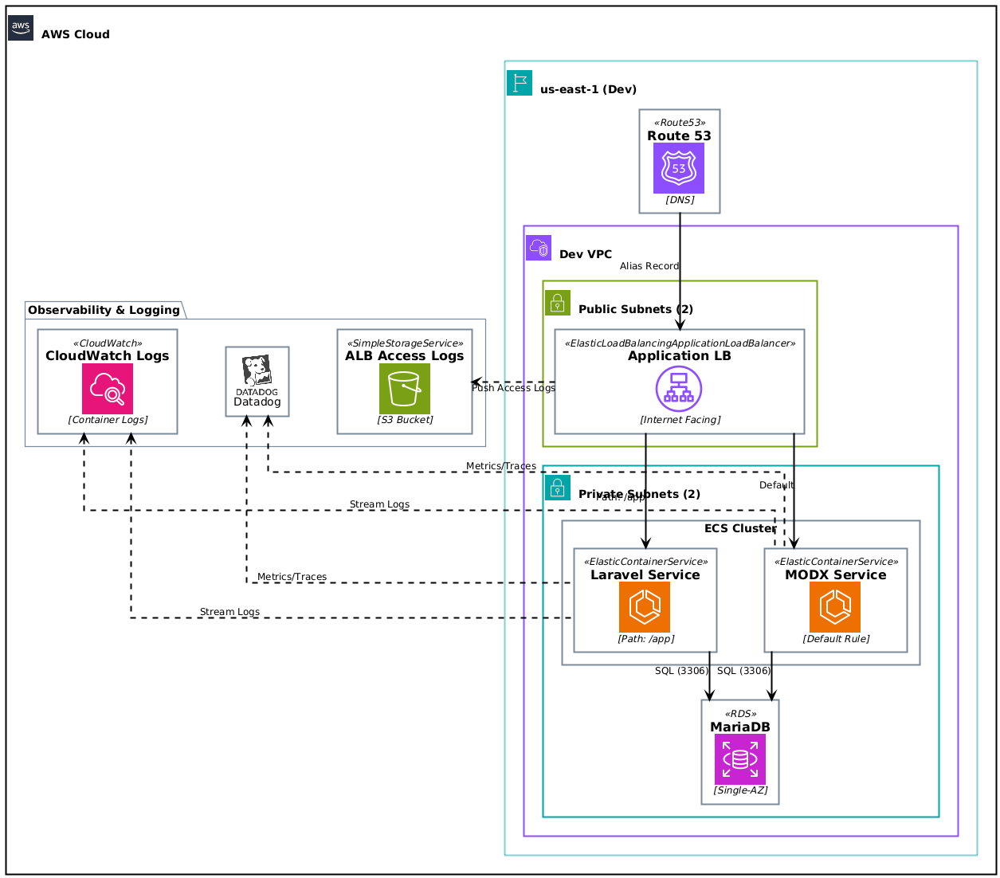
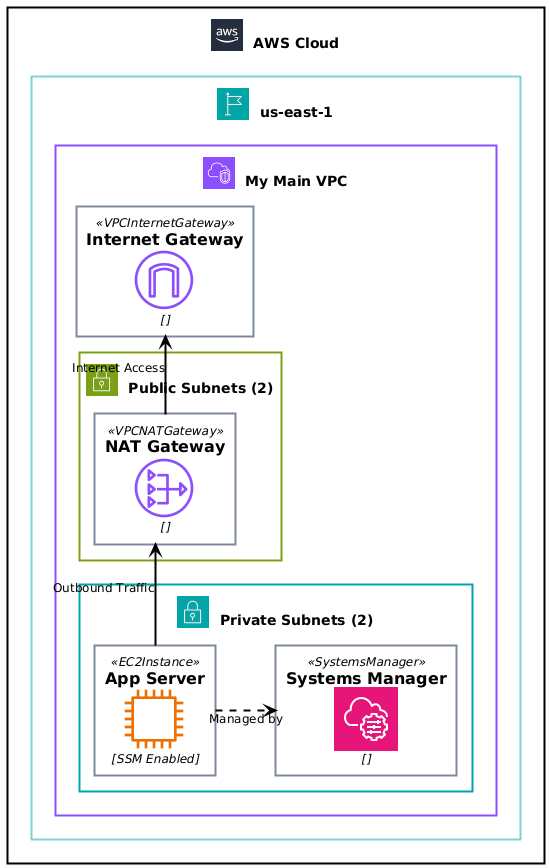
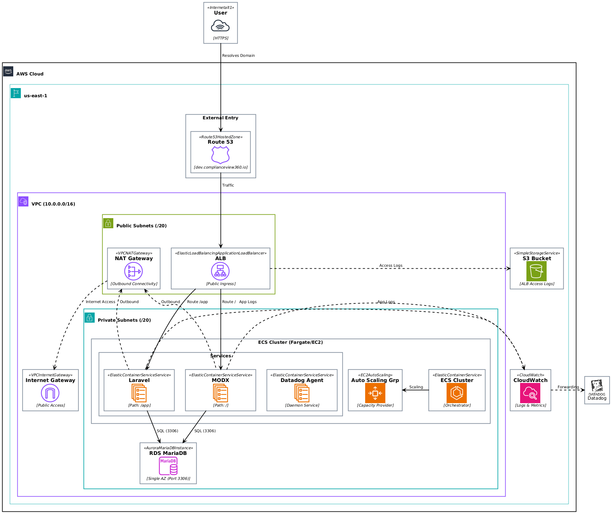

# Project Architecture Diagrams

This repository contains architectural diagrams illustrating the system's infrastructure, monitoring, and application flows.

<table width="100%">
  <tr>
    <td width="50%" align="center">
      <h3>Datadog Observability</h3>
      
      

        Comprehensive monitoring architecture integrating AWS services (ECS, RDS, S3) with Datadog for centralized logs and metrics visualization. Key components include Route53 DNS resolution, Application Load Balancers, and Fargate containers.
      

    </td>
    <td width="50%" align="center">
      <h3>Optic Architecture</h3>
      
      

        Detailed development environment setup featuring ECS services (Laravel, MODX), MariaDB database, and log streaming to CloudWatch. Highlights the separation of public and private subnets within the VPC.
      

    </td>
  </tr>
  <tr>
    <td width="50%" align="center">
      <h3>VPC Network Topology</h3>
      
      

        Foundational network infrastructure illustrating the segmentation of public and private subnets across availability zones. Includes NAT/Internet gateways for connectivity and EC2 instances managed via Systems Manager.
      

    </td>
    <td width="50%" align="center">
      <h3>High-Level Architecture</h3>
      
      

        High-level architecture diagram illustrating the interaction between AWS services (Route53, ALB, ECS, RDS, S3) and Datadog for a scalable and observable application infrastructure.
      

    </td>
  </tr>
</table>
